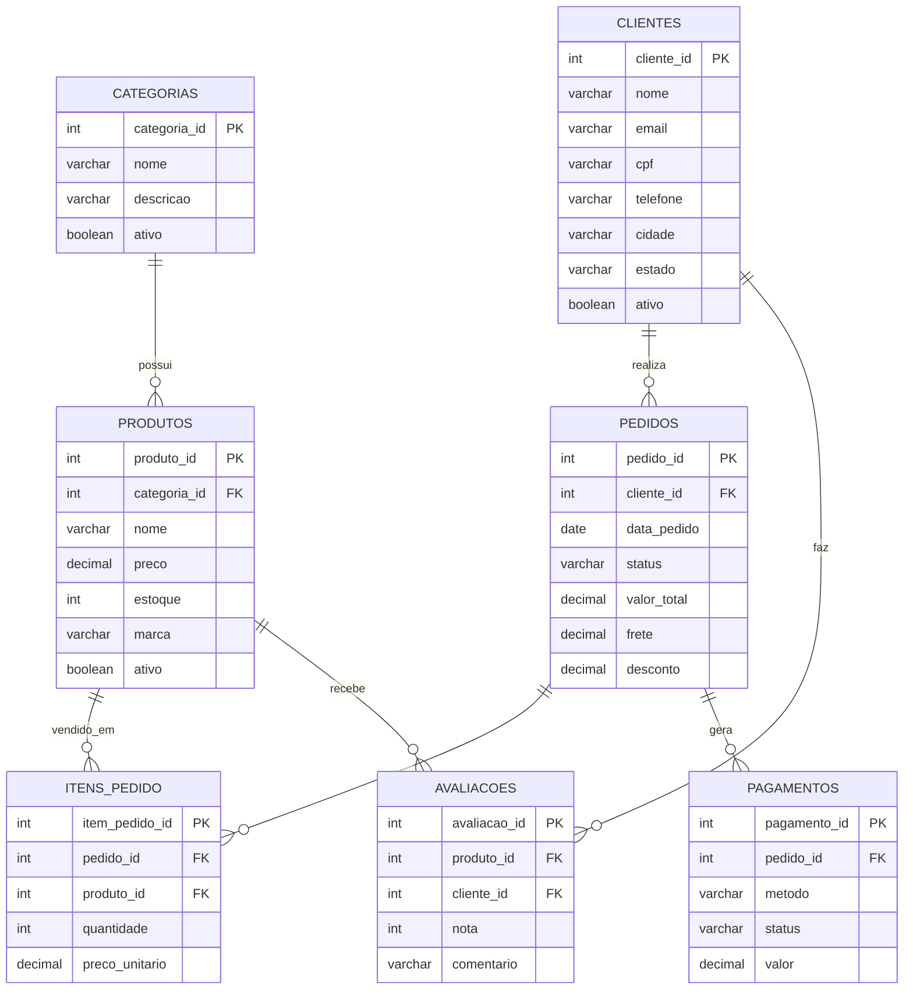

# Módulo 10 - JOINs - Material Didático

## Objetivo do Módulo
Dominar as técnicas de junção de tabelas em SQL, aprendendo a combinar dados de múltiplas tabelas usando INNER JOIN, LEFT JOIN, RIGHT JOIN, FULL OUTER JOIN e SELF JOIN.


## Introdução a PK e FK e Modelo EMR

Antes de aprender JOINs, é essencial entender como as tabelas se relacionam através de **chaves**.

### 🔑 Primary Key (PK) - Chave Primária

A **chave primária** é um identificador **único** para cada registro da tabela.

**Características:**
- Não pode ser NULL (vazia)
- Deve ser única (sem duplicatas)
- Geralmente é um número inteiro (ID)

**Exemplos:**
- `cliente_id` na tabela `clientes`
- `produto_id` na tabela `produtos`
- `pedido_id` na tabela `pedidos`

### 🔗 Foreign Key (FK) - Chave Estrangeira

A **chave estrangeira** é uma coluna que **referencia** a chave primária de outra tabela, criando um relacionamento entre elas.

**Características:**
- Aponta para a PK de outra tabela
- Pode ser NULL (registro sem relacionamento)
- Permite relacionar dados entre tabelas

**Exemplos:**
- `categoria_id` em `produtos` → referencia `categoria_id` em `categorias`
- `cliente_id` em `pedidos` → referencia `cliente_id` em `clientes`
- `produto_id` em `avaliacoes` → referencia `produto_id` em `produtos`

### 📊 Como PK e FK funcionam juntas

```
CATEGORIAS                    PRODUTOS
+--------------+             +--------------+
| categoria_id | ←─────────── | categoria_id | (FK)
| nome         |             | produto_id   | (PK)
| descricao    |             | nome         |
+--------------+             | preco        |
                             +--------------+
```

Quando fazemos um JOIN, usamos essas chaves para "conectar" as tabelas:
```sql
SELECT p.nome, c.nome AS categoria
FROM produtos p
INNER JOIN categorias c ON p.categoria_id = c.categoria_id;
```

### 🗺️ Modelo ER do E-commerce



**Legenda do Diagrama:**
- `||--o{` = Relacionamento **um para muitos** (1:N)
- Uma CATEGORIA pode ter vários PRODUTOS
- Um CLIENTE pode fazer vários PEDIDOS
- Um PEDIDO contém vários ITENS_PEDIDO

---
# AULA 42

<details>
<summary><strong>Expandir Aula 42</strong></summary>

## INNER JOIN - Juntando Tabelas

## O que é?

O `INNER JOIN` é usado para **combinar linhas de duas ou mais tabelas** baseado em uma condição de relacionamento. Retorna apenas as linhas que têm correspondência em **ambas** as tabelas.

## Sintaxe

```sql
SELECT colunas
FROM tabela1
INNER JOIN tabela2 ON tabela1.coluna = tabela2.coluna;
```

## Por que usar JOIN?

Bancos de dados relacionais armazenam dados em tabelas separadas para evitar redundância. O JOIN permite "reconstruir" a informação completa:

```
Tabela PRODUTOS:                    Tabela CATEGORIAS:
| produto_id | nome      | cat_id | | categoria_id | nome        |
|------------|-----------|--------|  |--------------|-------------|
| 1          | Smart TV  | 9      |  | 9            | Eletrônicos |
| 2          | Sofá      | 8      |  | 8            | Móveis      |
| 3          | Camisa    | 2      |  | 2            | Roupas      |

Resultado do INNER JOIN:
| produto_id | nome      | categoria   |
|------------|-----------|-------------|
| 1          | Smart TV  | Eletrônicos |
| 2          | Sofá      | Móveis      |
| 3          | Camisa    | Roupas      |
```

## Como funciona?

O INNER JOIN compara cada linha da primeira tabela com cada linha da segunda tabela. Quando a condição ON é verdadeira, as linhas são combinadas no resultado.

```sql
-- Produtos com suas categorias
SELECT
    p.nome AS produto,
    c.nome AS categoria
FROM produtos p
INNER JOIN categorias c ON p.categoria_id = c.categoria_id;
```

## Usando Aliases (Apelidos)

Aliases tornam as queries mais legíveis:

```sql
-- Sem alias (verboso)
SELECT produtos.nome, categorias.nome
FROM produtos
INNER JOIN categorias ON produtos.categoria_id = categorias.categoria_id;

-- Com alias (limpo)
SELECT p.nome, c.nome
FROM produtos p
INNER JOIN categorias c ON p.categoria_id = c.categoria_id;
```

## Exemplos Práticos

```sql
-- Pedidos com nome do cliente
SELECT
    ped.pedido_id,
    ped.data_pedido,
    ped.valor_total,
    cli.nome AS cliente
FROM pedidos ped
INNER JOIN clientes cli ON ped.cliente_id = cli.cliente_id;

-- Itens de pedido com nome do produto
SELECT
    ip.pedido_id,
    p.nome AS produto,
    ip.quantidade,
    ip.preco_unitario
FROM itens_pedido ip
INNER JOIN produtos p ON ip.produto_id = p.produto_id;

-- Avaliações com nome do produto e do cliente
SELECT
    p.nome AS produto,
    c.nome AS cliente,
    a.nota,
    a.comentario
FROM avaliacoes a
INNER JOIN produtos p ON a.produto_id = p.produto_id
INNER JOIN clientes c ON a.cliente_id = c.cliente_id;
```

## INNER JOIN com WHERE

```sql
-- Pedidos de clientes de São Paulo
SELECT
    ped.pedido_id,
    cli.nome,
    cli.estado,
    ped.valor_total
FROM pedidos ped
INNER JOIN clientes cli ON ped.cliente_id = cli.cliente_id
WHERE cli.estado = 'SP';
```

## O que acontece quando não há correspondência?

No INNER JOIN, linhas sem correspondência são **excluídas** do resultado:

```
Produtos:                     Categorias:
| id | nome   | cat_id |      | cat_id | nome     |
|----|--------|--------|      |--------|----------|
| 1  | TV     | 9      |      | 9      | Eletro   |
| 2  | Sofá   | 8      |      | 8      | Móveis   |
| 3  | Teste  | 99     |      | (99 não existe!)

INNER JOIN resultado:
| id | nome   | categoria |
|----|--------|-----------|
| 1  | TV     | Eletro    |
| 2  | Sofá   | Móveis    |
(Produto "Teste" não aparece pois categoria 99 não existe)
```

## Desafio

<details>
<summary><strong>Ver Desafios</strong></summary>

```sql
-- Aula 42 - Desafio 1: Listar todos os produtos com o nome de suas categorias
-- Mostre: nome do produto, preço, nome da categoria


-- Aula 42 - Desafio 2: Listar todos os pedidos com o nome dos clientes
-- Mostre: pedido_id, data_pedido, valor_total, nome do cliente, email do cliente

```

</details>

</details>

---

# AULA 43

<details>
<summary><strong>Expandir Aula 43</strong></summary>

## LEFT JOIN - Mantendo Todos à Esquerda

## O que é?

O `LEFT JOIN` (ou LEFT OUTER JOIN) retorna **todas as linhas da tabela à esquerda** e as linhas correspondentes da tabela à direita. Quando não há correspondência, os campos da tabela direita ficam como NULL.

## Sintaxe

```sql
SELECT colunas
FROM tabela_esquerda
LEFT JOIN tabela_direita ON tabela_esquerda.coluna = tabela_direita.coluna;
```

## Diferença entre INNER JOIN e LEFT JOIN

```
Tabela CLIENTES:              Tabela PEDIDOS:
| cliente_id | nome   |       | pedido_id | cliente_id |
|------------|--------|       |-----------|------------|
| 1          | João   |       | 101       | 1          |
| 2          | Maria  |       | 102       | 1          |
| 3          | Pedro  |       | (Pedro nunca comprou)

INNER JOIN: (só clientes COM pedidos)
| nome   | pedido_id |
|--------|-----------|
| João   | 101       |
| João   | 102       |

LEFT JOIN: (TODOS os clientes)
| nome   | pedido_id |
|--------|-----------|
| João   | 101       |
| João   | 102       |
| Maria  | NULL      |  ← Maria aparece, mesmo sem pedidos
| Pedro  | NULL      |  ← Pedro aparece, mesmo sem pedidos
```

## Exemplos Práticos

```sql
-- Todos os clientes e seus pedidos (incluindo quem nunca comprou)
SELECT
    c.nome AS cliente,
    c.email,
    p.pedido_id,
    p.valor_total
FROM clientes c
LEFT JOIN pedidos p ON c.cliente_id = p.cliente_id;

-- Todos os produtos e suas avaliações (incluindo sem avaliação)
SELECT
    p.nome AS produto,
    p.preco,
    a.nota,
    a.comentario
FROM produtos p
LEFT JOIN avaliacoes a ON p.produto_id = a.produto_id;

-- Todas as categorias e quantidade de produtos
SELECT
    c.nome AS categoria,
    COUNT(p.produto_id) AS total_produtos
FROM categorias c
LEFT JOIN produtos p ON c.categoria_id = p.categoria_id
GROUP BY c.categoria_id, c.nome;
```

## Encontrando registros SEM correspondência

O LEFT JOIN é perfeito para encontrar registros "órfãos":

```sql
-- Clientes que NUNCA fizeram pedidos
SELECT
    c.nome,
    c.email,
    c.data_cadastro
FROM clientes c
LEFT JOIN pedidos p ON c.cliente_id = p.cliente_id
WHERE p.pedido_id IS NULL;

-- Produtos que NUNCA foram vendidos
SELECT
    p.nome,
    p.preco,
    p.estoque
FROM produtos p
LEFT JOIN itens_pedido ip ON p.produto_id = ip.produto_id
WHERE ip.item_pedido_id IS NULL;

-- Produtos SEM avaliações
SELECT
    p.nome,
    p.marca
FROM produtos p
LEFT JOIN avaliacoes a ON p.produto_id = a.produto_id
WHERE a.avaliacao_id IS NULL;
```

## LEFT JOIN com múltiplas tabelas

```sql
-- Clientes, seus pedidos e pagamentos
SELECT
    c.nome AS cliente,
    p.pedido_id,
    p.valor_total,
    pg.metodo AS forma_pagamento,
    pg.status AS status_pagamento
FROM clientes c
LEFT JOIN pedidos p ON c.cliente_id = p.cliente_id
LEFT JOIN pagamentos pg ON p.pedido_id = pg.pedido_id;
```

## Quando usar LEFT JOIN?

- Relatórios que precisam mostrar **todos** os registros de uma tabela
- Encontrar registros sem correspondência (usando WHERE ... IS NULL)
- Análises que não podem "perder" dados da tabela principal

## Desafio

<details>
<summary><strong>Ver Desafios</strong></summary>

```sql
-- Aula 43 - Desafio 1: Listar todos os produtos, incluindo os que nunca foram vendidos
-- Mostre: nome do produto, preço, quantidade vendida (ou NULL se nunca vendido)
-- Dica: Use a tabela itens_pedido para verificar vendas


-- Aula 43 - Desafio 2: Listar todos os clientes, incluindo os que nunca fizeram pedidos
-- Mostre: nome do cliente, email, quantidade de pedidos (0 se nunca fez)
-- Dica: Use COUNT() que conta 0 para NULL

```

</details>

</details>

---

# AULA 44

<details>
<summary><strong>Expandir Aula 44</strong></summary>

## RIGHT JOIN - Mantendo Todos à Direita

## O que é?

O `RIGHT JOIN` (ou RIGHT OUTER JOIN) é o **oposto do LEFT JOIN**. Retorna **todas as linhas da tabela à direita** e as linhas correspondentes da tabela à esquerda.

## Sintaxe

```sql
SELECT colunas
FROM tabela_esquerda
RIGHT JOIN tabela_direita ON tabela_esquerda.coluna = tabela_direita.coluna;
```

## LEFT JOIN vs RIGHT JOIN

```sql
-- Estas duas queries retornam o MESMO resultado:

-- Usando LEFT JOIN
SELECT c.nome, p.pedido_id
FROM clientes c
LEFT JOIN pedidos p ON c.cliente_id = p.cliente_id;

-- Usando RIGHT JOIN (tabelas invertidas)
SELECT c.nome, p.pedido_id
FROM pedidos p
RIGHT JOIN clientes c ON p.cliente_id = c.cliente_id;
```

## Visualização

```
LEFT JOIN (clientes à esquerda):
CLIENTES ←──── PEDIDOS
[Todos]        [Correspondentes]

RIGHT JOIN (clientes à direita):
PEDIDOS ────→ CLIENTES
[Correspondentes]  [Todos]
```

## Exemplos Práticos

```sql
-- Todos os pedidos e seus pagamentos (mantendo todos os pedidos)
SELECT
    p.pedido_id,
    p.valor_total,
    pg.metodo,
    pg.status AS status_pagamento
FROM pagamentos pg
RIGHT JOIN pedidos p ON pg.pedido_id = p.pedido_id;

-- Todas as categorias e seus produtos
SELECT
    p.nome AS produto,
    c.nome AS categoria
FROM produtos p
RIGHT JOIN categorias c ON p.categoria_id = c.categoria_id;
```

## Encontrando registros sem correspondência

```sql
-- Pedidos SEM pagamento registrado
SELECT
    p.pedido_id,
    p.data_pedido,
    p.valor_total,
    p.status
FROM pagamentos pg
RIGHT JOIN pedidos p ON pg.pedido_id = p.pedido_id
WHERE pg.pagamento_id IS NULL;
```

## Quando usar RIGHT JOIN?

Na prática, o RIGHT JOIN é **raramente usado** porque:
1. LEFT JOIN é mais intuitivo (lemos da esquerda para direita)
2. Você sempre pode reescrever um RIGHT JOIN como LEFT JOIN invertendo as tabelas

```sql
-- RIGHT JOIN
SELECT * FROM A RIGHT JOIN B ON A.id = B.id;

-- Equivalente com LEFT JOIN (preferido)
SELECT * FROM B LEFT JOIN A ON B.id = A.id;
```

**Recomendação:** Use LEFT JOIN e organize as tabelas na ordem que faz mais sentido para seu relatório.

## Desafio

<details>
<summary><strong>Ver Desafios</strong></summary>

```sql
-- Aula 44 - Desafio 1: Listar todos os pedidos e seus pagamentos (mantendo pedidos sem pagamento)
-- Mostre: pedido_id, valor_total do pedido, método de pagamento, valor do pagamento
-- Use RIGHT JOIN com pedidos à direita


-- Aula 44 - Desafio 2: Reescreva o desafio anterior usando LEFT JOIN
-- O resultado deve ser idêntico

```

</details>

</details>

---

# AULA 45

<details>
<summary><strong>Expandir Aula 45</strong></summary>

## FULL OUTER JOIN - Mantendo Todos os Registros

## O que é?

O `FULL OUTER JOIN` (ou FULL JOIN) retorna **todas as linhas de ambas as tabelas**. Quando não há correspondência, os campos ficam como NULL.

## Sintaxe

```sql
SELECT colunas
FROM tabela1
FULL OUTER JOIN tabela2 ON tabela1.coluna = tabela2.coluna;
```

## Visualização

```
INNER JOIN:     Apenas a interseção
LEFT JOIN:      Toda a esquerda + interseção
RIGHT JOIN:     Interseção + toda a direita
FULL OUTER:     Tudo de ambas as tabelas

Tabela A:        Tabela B:
| id | val |     | id | val |
|----|-----|     |----|-----|
| 1  | A1  |     | 1  | B1  |
| 2  | A2  |     | 3  | B3  |
| 4  | A4  |     | 5  | B5  |

FULL OUTER JOIN:
| A.id | A.val | B.id | B.val |
|------|-------|------|-------|
| 1    | A1    | 1    | B1    |  ← Correspondência
| 2    | A2    | NULL | NULL  |  ← Só em A
| 4    | A4    | NULL | NULL  |  ← Só em A
| NULL | NULL  | 3    | B3    |  ← Só em B
| NULL | NULL  | 5    | B5    |  ← Só em B
```

## Exemplos Práticos

```sql
-- Todos os produtos e todas as avaliações
SELECT
    p.produto_id,
    p.nome AS produto,
    a.avaliacao_id,
    a.nota
FROM produtos p
FULL OUTER JOIN avaliacoes a ON p.produto_id = a.produto_id;

-- Comparar categorias e produtos
SELECT
    c.nome AS categoria,
    p.nome AS produto
FROM categorias c
FULL OUTER JOIN produtos p ON c.categoria_id = p.categoria_id;
```

## Identificando registros órfãos de ambos os lados

```sql
-- Encontrar inconsistências: produtos sem categoria OU categorias sem produtos
SELECT
    c.categoria_id,
    c.nome AS categoria,
    p.produto_id,
    p.nome AS produto
FROM categorias c
FULL OUTER JOIN produtos p ON c.categoria_id = p.categoria_id
WHERE c.categoria_id IS NULL    -- Produto sem categoria válida
   OR p.produto_id IS NULL;     -- Categoria sem produtos
```

## Quando usar FULL OUTER JOIN?

- **Auditoria de dados:** Encontrar inconsistências entre tabelas relacionadas
- **Comparação de datasets:** Ver o que existe em um lado mas não no outro
- **Relatórios completos:** Quando nenhum dado pode ser perdido

## Nota sobre compatibilidade

Nem todos os bancos de dados suportam FULL OUTER JOIN nativamente:
- **PostgreSQL, SQL Server, Oracle:** Suportam
- **MySQL:** Não suporta diretamente (precisa usar UNION de LEFT e RIGHT JOIN)

```sql
-- Simulando FULL OUTER JOIN no MySQL:
SELECT * FROM tabela1 LEFT JOIN tabela2 ON ...
UNION
SELECT * FROM tabela1 RIGHT JOIN tabela2 ON ...
```

## Desafio

<details>
<summary><strong>Ver Desafios</strong></summary>

```sql
-- Aula 45 - Desafio 1: Listar todos os produtos e todas as avaliações
-- Mostre produtos sem avaliação E avaliações (se houver alguma órfã)
-- Mostre: produto_id, nome do produto, avaliacao_id, nota


-- Aula 45 - Desafio 2: Produtos com baixo engajamento de avaliações
-- Liste produtos com poucas ou nenhuma avaliação (menos de 3 avaliações)
-- Use FULL OUTER JOIN para garantir que todos os produtos sejam incluídos

```

</details>

</details>

---

# AULA 46

<details>
<summary><strong>Expandir Aula 46</strong></summary>

## SELF JOIN - Juntando Tabela com Ela Mesma

## O que é?

O `SELF JOIN` é quando você junta uma tabela **com ela mesma**. É útil para comparar linhas dentro da mesma tabela ou encontrar relacionamentos hierárquicos.

## Sintaxe

```sql
SELECT colunas
FROM tabela t1
INNER JOIN tabela t2 ON condição;
```

**Importante:** Você DEVE usar aliases diferentes (t1, t2) para diferenciar as duas "cópias" da tabela.

## Casos de Uso

### 1. Encontrar clientes na mesma cidade

```sql
-- Clientes que moram na mesma cidade
SELECT
    c1.nome AS cliente1,
    c2.nome AS cliente2,
    c1.cidade
FROM clientes c1
INNER JOIN clientes c2
    ON c1.cidade = c2.cidade
    AND c1.cliente_id < c2.cliente_id;  -- Evita duplicatas e auto-match
```

A condição `c1.cliente_id < c2.cliente_id` é importante para:
- Evitar que o cliente seja comparado consigo mesmo (João - João)
- Evitar pares duplicados (João-Maria e Maria-João)

### 2. Encontrar produtos com preços similares

```sql
-- Produtos com diferença de preço menor que R$ 50
SELECT
    p1.nome AS produto1,
    p1.preco AS preco1,
    p2.nome AS produto2,
    p2.preco AS preco2,
    ABS(p1.preco - p2.preco) AS diferenca
FROM produtos p1
INNER JOIN produtos p2
    ON p1.produto_id < p2.produto_id
    AND ABS(p1.preco - p2.preco) < 50;
```

**O que é ABS()?**
A função `ABS()` retorna o valor **absoluto** (sempre positivo) de um número. É útil quando queremos calcular diferenças sem nos preocupar com a ordem da subtração.

- `ABS(100 - 150)` = 50 (em vez de -50)
- `ABS(150 - 100)` = 50 (mesmo resultado)

No exemplo acima, usamos `ABS()` para garantir que a diferença entre preços seja sempre positiva, independentemente de qual produto é mais caro.

### 3. Produtos da mesma marca

```sql
-- Encontrar pares de produtos da mesma marca
SELECT
    p1.nome AS produto1,
    p2.nome AS produto2,
    p1.marca
FROM produtos p1
INNER JOIN produtos p2
    ON p1.marca = p2.marca
    AND p1.produto_id < p2.produto_id
ORDER BY p1.marca;
```

### 4. Comparar pedidos do mesmo cliente

```sql
-- Pedidos do mesmo cliente em datas diferentes
SELECT
    c.nome AS cliente,
    p1.pedido_id AS pedido1,
    p1.data_pedido AS data1,
    p2.pedido_id AS pedido2,
    p2.data_pedido AS data2
FROM pedidos p1
INNER JOIN pedidos p2
    ON p1.cliente_id = p2.cliente_id
    AND p1.pedido_id < p2.pedido_id
INNER JOIN clientes c ON p1.cliente_id = c.cliente_id;
```

## Estruturas hierárquicas

SELF JOIN é essencial para tabelas com auto-referência (funcionário → gerente):

```sql
-- Exemplo conceitual de hierarquia
-- Se tivéssemos uma tabela funcionarios com gerente_id:
SELECT
    f.nome AS funcionario,
    g.nome AS gerente
FROM funcionarios f
LEFT JOIN funcionarios g ON f.gerente_id = g.funcionario_id;
```

## Cuidados com SELF JOIN

1. **Sempre use aliases** - Obrigatório para diferenciar as instâncias
2. **Evite comparações redundantes** - Use `<` ou `>` para evitar duplicatas
3. **Performance** - SELF JOIN pode ser lento em tabelas grandes

## Desafio

<details>
<summary><strong>Ver Desafios</strong></summary>

```sql
-- Aula 46 - Desafio 1: Encontrar clientes que moram na mesma cidade
-- Mostre: nome do cliente 1, nome do cliente 2, cidade
-- Evite duplicatas e auto-comparação


-- Aula 46 - Desafio 2: Encontrar produtos da mesma categoria com preços similares
-- Considere "similar" uma diferença menor que R$ 100
-- Mostre: produto1, preco1, produto2, preco2, categoria_id, diferença de preço

```

</details>

</details>

---

# AULA 47

<details>
<summary><strong>Expandir Aula 47</strong></summary>

## Múltiplos JOINs na Mesma Consulta

## O que é?

Em consultas reais, frequentemente precisamos combinar **3 ou mais tabelas** para obter todas as informações necessárias. Isso é feito encadeando múltiplos JOINs.

## Sintaxe

```sql
SELECT colunas
FROM tabela1
JOIN tabela2 ON tabela1.col = tabela2.col
JOIN tabela3 ON tabela2.col = tabela3.col
JOIN tabela4 ON tabela3.col = tabela4.col;
```

## Exemplo: Relatório completo de pedidos

Vamos construir um relatório que mostra:
- Dados do pedido
- Nome do cliente
- Produtos comprados
- Categoria dos produtos

```sql
SELECT
    p.pedido_id,
    p.data_pedido,
    c.nome AS cliente,
    prod.nome AS produto,
    cat.nome AS categoria,
    ip.quantidade,
    ip.preco_unitario
FROM pedidos p
INNER JOIN clientes c ON p.cliente_id = c.cliente_id
INNER JOIN itens_pedido ip ON p.pedido_id = ip.pedido_id
INNER JOIN produtos prod ON ip.produto_id = prod.produto_id
INNER JOIN categorias cat ON prod.categoria_id = cat.categoria_id
ORDER BY p.pedido_id, prod.nome;
```

## Exemplos Práticos

### Pedidos com cliente, pagamento e itens

```sql
SELECT
    p.pedido_id,
    c.nome AS cliente,
    c.cidade,
    p.valor_total,
    pg.metodo AS forma_pagamento,
    pg.status AS status_pagamento,
    COUNT(ip.item_pedido_id) AS qtd_itens
FROM pedidos p
INNER JOIN clientes c ON p.cliente_id = c.cliente_id
LEFT JOIN pagamentos pg ON p.pedido_id = pg.pedido_id
INNER JOIN itens_pedido ip ON p.pedido_id = ip.pedido_id
GROUP BY p.pedido_id, c.nome, c.cidade, p.valor_total, pg.metodo, pg.status;
```

### Relatório de avaliações completo

```sql
SELECT
    prod.nome AS produto,
    cat.nome AS categoria,
    prod.marca,
    c.nome AS cliente,
    c.estado,
    a.nota,
    a.comentario,
    a.data_avaliacao
FROM avaliacoes a
INNER JOIN produtos prod ON a.produto_id = prod.produto_id
INNER JOIN categorias cat ON prod.categoria_id = cat.categoria_id
INNER JOIN clientes c ON a.cliente_id = c.cliente_id
ORDER BY a.data_avaliacao DESC;
```

### Dashboard de vendas por categoria

```sql
SELECT
    cat.nome AS categoria,
    COUNT(DISTINCT p.pedido_id) AS total_pedidos,
    SUM(ip.quantidade) AS unidades_vendidas,
    SUM(ip.quantidade * ip.preco_unitario) AS faturamento
FROM categorias cat
INNER JOIN produtos prod ON cat.categoria_id = prod.categoria_id
INNER JOIN itens_pedido ip ON prod.produto_id = ip.produto_id
INNER JOIN pedidos p ON ip.pedido_id = p.pedido_id
WHERE p.status NOT IN ('cancelado')
GROUP BY cat.categoria_id, cat.nome
ORDER BY faturamento DESC;
```

## Misturando tipos de JOIN

```sql
-- Todos os clientes, seus pedidos (se existirem) e avaliações (se existirem)
SELECT
    c.nome AS cliente,
    COUNT(DISTINCT p.pedido_id) AS total_pedidos,
    COUNT(DISTINCT a.avaliacao_id) AS total_avaliacoes
FROM clientes c
LEFT JOIN pedidos p ON c.cliente_id = p.cliente_id
LEFT JOIN avaliacoes a ON c.cliente_id = a.cliente_id
GROUP BY c.cliente_id, c.nome;
```

## Dicas para múltiplos JOINs

1. **Comece pela tabela principal** - A tabela que contém os dados mais importantes
2. **Siga os relacionamentos** - JOIN nas tabelas conforme as foreign keys
3. **Use aliases consistentes** - Facilita a leitura (p para pedidos, c para clientes, etc.)
4. **Cuidado com duplicação** - Múltiplos JOINs podem multiplicar linhas
5. **Use DISTINCT ou GROUP BY** quando necessário

## Ordem de execução

```sql
FROM tabela1                    -- 1º
JOIN tabela2 ON ...             -- 2º
JOIN tabela3 ON ...             -- 3º
WHERE condição                  -- 4º
GROUP BY coluna                 -- 5º
HAVING condição_agregação       -- 6º
SELECT colunas                  -- 7º
ORDER BY coluna                 -- 8º
LIMIT número                    -- 9º
```

## Desafio

<details>
<summary><strong>Ver Desafios</strong></summary>

```sql
-- Aula 47 - Desafio 1: Listar pedidos com nome do cliente, produtos comprados e categoria
-- Mostre: pedido_id, data_pedido, nome do cliente, nome do produto, categoria, quantidade
-- Ordene por pedido_id


-- Aula 47 - Desafio 2: Criar relatório completo de vendas
-- Mostre: pedido_id, cliente, cidade do cliente, produto, categoria,
--         quantidade, valor unitário, subtotal (qtd * valor), forma de pagamento
-- Apenas pedidos com status 'entregue'
-- Ordene por data do pedido (mais recente primeiro)

```

</details>

</details>

---

## Resumo Rápido

| Tipo de JOIN | O que retorna | Quando usar |
|--------------|---------------|-------------|
| `INNER JOIN` | Apenas registros com correspondência em ambas | Quando precisa de dados completos |
| `LEFT JOIN` | Todos da esquerda + correspondentes da direita | Relatórios, encontrar órfãos |
| `RIGHT JOIN` | Correspondentes da esquerda + todos da direita | Raramente usado (prefira LEFT) |
| `FULL OUTER JOIN` | Todos de ambas as tabelas | Auditoria, comparação de dados |
| `SELF JOIN` | Tabela com ela mesma | Hierarquias, comparações internas |

---

## Diagrama Visual dos JOINs

```
    INNER JOIN          LEFT JOIN           RIGHT JOIN        FULL OUTER JOIN

    ┌───┐ ┌───┐        ┌───┐ ┌───┐        ┌───┐ ┌───┐        ┌───┐ ┌───┐
    │ A │ │ B │        │ A │ │ B │        │ A │ │ B │        │ A │ │ B │
    │   │ │   │        │███│ │   │        │   │ │███│        │███│ │███│
    │ ██│█│██ │        │ ██│█│██ │        │ ██│█│██ │        │ ██│█│██ │
    │   │ │   │        │   │ │   │        │   │ │   │        │   │ │   │
    └───┘ └───┘        └───┘ └───┘        └───┘ └───┘        └───┘ └───┘

    Só interseção      Toda A +           Interseção +       Tudo de A e B
                       interseção         toda B
```

---

## Checklist de Domínio

- [ ] Sei usar INNER JOIN para combinar tabelas
- [ ] Entendo a diferença entre INNER e LEFT JOIN
- [ ] Uso LEFT JOIN para incluir registros sem correspondência
- [ ] Sei encontrar registros órfãos com LEFT JOIN + WHERE IS NULL
- [ ] Entendo que RIGHT JOIN é o inverso do LEFT JOIN
- [ ] Sei quando usar FULL OUTER JOIN
- [ ] Consigo fazer SELF JOIN para comparar registros na mesma tabela
- [ ] Sei encadear múltiplos JOINs em uma única query
- [ ] Uso aliases para tornar as queries legíveis
- [ ] Entendo a ordem de execução do SQL com JOINs

---

## Próximos Passos

1. **Pratique** todos os desafios de cada aula
2. **Experimente** combinar diferentes tipos de JOIN
3. **Crie** relatórios complexos com múltiplas tabelas
4. **Avance** para o próximo módulo!

---

## Desafio Final do Módulo 10

<details>
<summary><strong>Expandir Desafio Final</strong></summary>

Parabéns por chegar até aqui! Agora é hora de testar tudo que você aprendeu sobre JOINs.

### Contexto

Você é analista de dados de um e-commerce e precisa criar relatórios gerenciais que combinam dados de múltiplas tabelas.

### Desafios

```sql
-- Desafio Final 1: Catálogo Completo
-- Liste todos os produtos com suas categorias
-- Mostre: nome do produto, preço, estoque, marca, nome da categoria
-- Inclua produtos mesmo que a categoria esteja inativa
-- Ordene por categoria e depois por nome do produto


-- Desafio Final 2: Clientes sem Compras
-- Encontre todos os clientes que nunca fizeram pedidos
-- Mostre: nome, email, cidade, estado, data de cadastro
-- Ordene por data de cadastro (mais antigos primeiro)


-- Desafio Final 3: Análise de Pagamentos
-- Liste todos os pedidos com informações de pagamento
-- Mostre: pedido_id, nome do cliente, valor do pedido, método de pagamento, status do pagamento
-- Inclua pedidos que ainda não têm pagamento registrado
-- Ordene por valor do pedido (maior primeiro)


-- Desafio Final 4: Produtos Mais Avaliados
-- Liste produtos que têm avaliações, com estatísticas
-- Mostre: nome do produto, categoria, quantidade de avaliações, nota média
-- Apenas produtos com mais de 1 avaliação
-- Ordene por nota média (maior primeiro)


-- Desafio Final 5: Relatório de Vendas por Cliente (Desafio Avançado)
-- Para cada cliente que fez pedidos, mostre:
-- Nome do cliente, cidade, estado, total de pedidos, valor total gasto, ticket médio
-- Apenas clientes com mais de 1 pedido
-- Ordene por valor total gasto (maior primeiro)


-- Desafio Final 6: Dashboard Completo (Boss Final!)
-- Crie um relatório detalhado de vendas que mostre:
-- - pedido_id
-- - data do pedido
-- - nome do cliente
-- - cidade e estado do cliente
-- - nome do produto
-- - categoria do produto
-- - quantidade comprada
-- - preço unitário
-- - subtotal (quantidade * preço unitário)
-- - método de pagamento
-- Filtros:
-- - Apenas pedidos com status 'entregue' ou 'enviado'
-- - Apenas produtos de categorias ativas
-- Ordene por data do pedido (mais recente primeiro), depois por pedido_id

```

### Dicas

- Use aliases para facilitar a leitura (c para clientes, p para pedidos, etc.)
- LEFT JOIN quando precisar incluir registros sem correspondência
- INNER JOIN quando precisar apenas de registros completos
- Combine com WHERE, GROUP BY e HAVING conforme necessário
- Lembre-se: a tabela itens_pedido conecta pedidos a produtos

</details>

---

## Como Usar Este Material

1. Estude uma aula por vez
2. Leia todos os conceitos com atenção
3. Pratique os desafios antes de avançar
4. Revise os conceitos quando necessário
5. Use o resumo para consultas rápidas

**Dica:** Cada aula tem seções expansíveis (clique para abrir/fechar) para facilitar a navegação!
