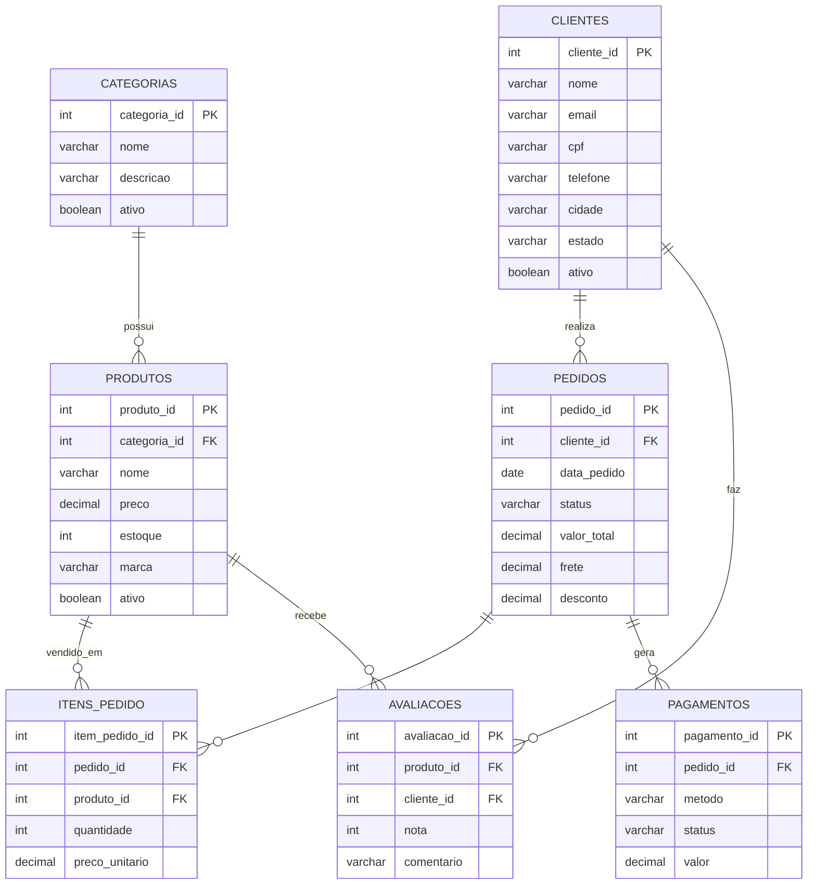

# 📚 Trilha SQL - Materiais de Aprendizado

## 🎯 Objetivo
Dominar os fundamentos do SQL através de aulas práticas e desafios progressivos.

---

## 🗺️ Trilha de Aprendizado

[](https://postimg.cc/WDjNY71g)

---
## 📖 Módulos Disponíveis

| # | Módulo | Descrição |
|---|--------|-----------|
| 01 | [Introdução](01%20-%20Introdução/) | Render, PostgreSQL, Configuração do Ambiente |
| 02 | [Fundamentos - SELECT](02%20-%20Fundamentos%20-%20SELECT/) | SELECT, FROM, ORDER BY, LIMIT |
| 03 | [Filtros Avançados](03%20-%20Filtros%20Avançados/) | WHERE, AND, OR, LIKE, IN, BETWEEN |
| 04 | [Funções de String](04%20-%20Funções%20de%20String/) | CONCAT, UPPER, LOWER, TRIM, SUBSTRING |
| 05 | [Funções de Data](05%20-%20Funções%20de%20Data/) | DATE_PART, DATE_ADD, DATE_DIFF, DATE_FORMAT |
| 06 | [Conversão de Dados](06%20-%20Conversão%20de%20Dados/) | CAST, COALESCE |
| 07 | [Condicionais](07%20-%20Condicionais/) | CASE WHEN, IF |
| 08 | [Funções de Agregação](08%20-%20Funções%20de%20Agregação/) | COUNT, SUM, AVG, MIN, MAX |
| 09 | [Agrupamento](09%20-%20Agrupamento/) | GROUP BY, HAVING |
| 10 | [JOINs](10%20-%20JOINs/) | INNER JOIN, LEFT JOIN, RIGHT JOIN, FULL JOIN |
| 11 | [Combinando Resultados](11%20-%20Combinando%20Resultados/) | UNION, INTERSECT, EXCEPT |
| 12 | [Subconsultas](12%20-%20Subconsultas/) | Subqueries, EXISTS, IN |
| 13 | [Window Functions](13%20-%20Window%20Functions/) | ROW_NUMBER, RANK, LAG, LEAD |
| 14 | [CTEs](14%20-%20CTEs/) | WITH, Common Table Expressions |
| 15 | [Manipulação de Dados](15%20-%20Manipulação%20de%20Dados/) | CREATE, INSERT, UPDATE, DELETE, DROP |

---

## 🗄️ Banco de Dados

O banco de dados de e-commerce utilizado nos exercícios contém as seguintes tabelas:

| Tabela | Descrição |
|--------|-----------|
| `categorias` | Categorias de produtos |
| `produtos` | Catálogo de produtos |
| `clientes` | Dados dos clientes |
| `pedidos` | Pedidos realizados |
| `itens_pedido` | Itens de cada pedido |
| `pagamentos` | Pagamentos dos pedidos |
| `avaliacoes` | Avaliações de produtos |

## 🗺️ Modelo ER


---

## 📖 Como Usar Este Material

1. Execute o script do banco de dados no PostgreSQL
2. Estude um módulo por vez, na ordem sugerida
3. Leia a teoria antes de praticar
4. Resolva os desafios de cada aula
5. Complete o desafio final do módulo
6. Avance para o próximo módulo

---

## 📂 Estrutura de Cada Módulo

```
XX - Nome do Módulo/
├── doc_teorico.md           # Material teórico com exemplos
├── desafio_final_respostas.sql  # Gabarito do desafio final
└── desafios_aulas.sql               # Gabarito dos desafios feito em aula
```

---

## 💪 Bons Estudos!

Pratique bastante e não tenha medo de errar. SQL é uma habilidade que se desenvolve com a prática!

---

## 👨‍💻 Autor

**Carlos Oliveira**

[](https://www.linkedin.com/in/carlosoliveira2910/)
